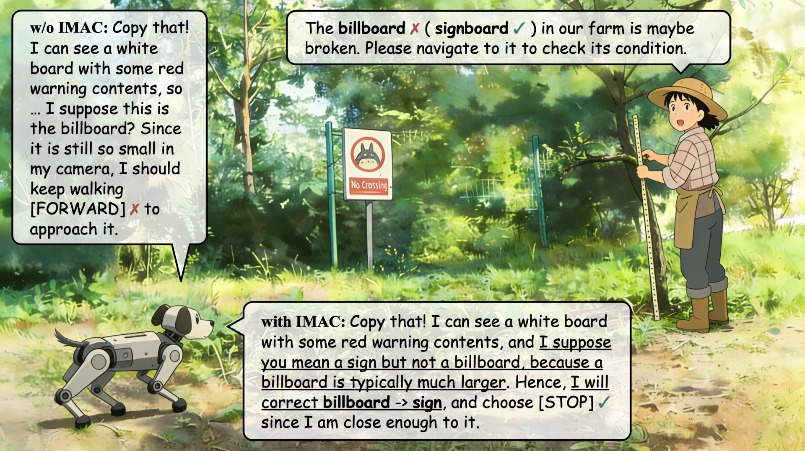
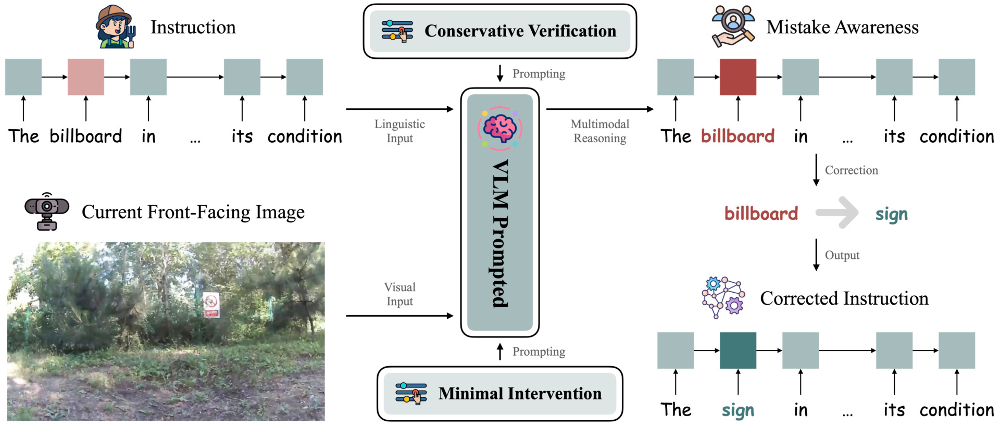

<div align="center">
<h1>IMAC-AgriVLN: Can Agricultural Vision-and-Language Navigation Agents be Aware of Instruction Mistakes?</h1>

[Xiaobei Zhao](https://orcid.org/0009-0005-3123-5536) · Xingqi Lyu · [Xin Chen](https://faculty.cau.edu.cn/cx/)<sup>✉️</sup> · [Xiang Li](https://faculty.cau.edu.cn/lx_7543/)<sup>✉️</sup>

**[China Agricultural University](https://ciee.cau.edu.cn)**

xiaobeizhao2002@163.com, lxq99725@163.com, chxin@cau.edu.cn, cqlixiang@cau.edu.cn

<p>
  <a href="https://arxiv.org/abs/2606.02519"></a>
  <a href="LICENSE"></a>
</p>


<!-- IMAC-AgriVLN Illustration -->
</div>

<!-- > MDE-AgriVLN v.s. Human and Baseline on a representative episode. In every method's section, the right images are the visual inputs at the time step $t = 6.2s$ (marked by the white arrows), the bottom textbox is the reasoning result at the same time step, and the top textbox is the evaluation result. Underline marks the pivotal reasoning thoughts. -->

## Updates
- [June 1st, 2026] The paper “IMAC-AgriVLN: Can Agricultural Vision-and-Language Navigation Agents be Aware of Instruction Mistakes?” is available for reading on [arXiv](https://arxiv.org/abs/2606.02519).

## Overview
Agricultural robots are serving as powerful assistants across a wide range of agricultural tasks, nevertheless, still heavily relying on manual operations or railway systems for movement. The AgriVLN method and the A2A benchmark pioneeringly extended Vision-and-Language Navigation (VLN) to the agricultural domain, enabling a robot to navigate to a target position following a natural language instruction. However, almost all the prior methods adopt an ideal assumption that the given instructions themselves are correct, which does not align with the realistic scenarios, because anybody may say an instruction with mistakes.

To bridge this gap, we propose the A2A-MI benchmark, in which we build a semi-automatic data annotator to insert three mistake classifications into each original instruction in a more diversified and efficient way. We test several state-of-the-art agricultural VLN agents on it and observe a sufficient drop with -57% on SR and -9% on NE, from which we suggest that an agricultural VLN agent tends to assume that the given instruction is correct, so does not have the awareness to doubt it when the scenes it sees do not align with the instruction it receives. To build the awareness on instruction mistake, we propose the IMAC module analyzing the instruction and the current front-facing image, to judge whether the instruction has mistakes and attempt to correct it when needed. We integrate IMAC into the baseline model, and observe a noteworthy improvement, sufficiently narrowing the gap to the performance on instructions without mistakes.



<!-- > MDE-AgriVLN methodology illustration: The MDE module (yellow part) takes a single frame from a camera video streaming as input, to output the depth feature in two representation classifications. The base model (green part) simultaneously understand the instruction, RGB input and depth input, to reason the most appropriate low-level action with an explicit thought. -->

## Quick Start
Currently, the paper “IMAC-AgriVLN: Can Agricultural Vision-and-Language Navigation Agents be Aware of Instruction Mistakes?” is under review as a conference submission. After the paper is published, we will make both the A2A-MI benchmark and the IMAC-AgriVLN method available as soon as possible.

## Acknowledgment
This work is supported by the Sichuan Chengdu Modern Agricultural Industry Research Institute of China Agricultural University: Provincial and Municipal Agricultural Subsidy Funded Project; the Natural Science Foundation of Sichuan Province (2024NSFSC0389); and the Provincial and Municipal Agricultural Subsidy Special Funds for the Construction of CAU–SCCD Advanced Agricultural \& Industrial Institute. Thanks to Chiang Mai, Chiang Rai, and Bangkok for the impressive traveling experiences, giving us a chilled vibe for experiment and writing. Thanks to Yuanquan Xu, the inspiration to us.

## Citation
If our paper or method is helpful for your research, welcome you use the following citation:
```bibtex
@inproceedings{IMAC-AgriVLN,
  title={IMAC-AgriVLN: Can Agricultural Vision-and-Language Navigation Agents be Aware of Instruction Mistakes?},
  author={Xiaobei Zhao and Xingqi Lyu and Xin Chen and Xiang Li},
  booktitle={arXiv:2606.02519},
  year={2026}
}
```

## Communication
If you have any issues with our study, welcome you contact the first author (Xiaobei Zhao, xiaobeizhao2002@163.com) to share your findings and thoughts with us.